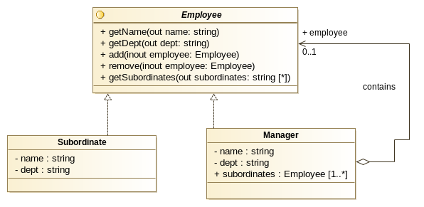

### COMPOSITE PATTERN

neste exemplo criamos uma árvore que contém responsaveis de departamento (Manager) e funcionários desses departamentos (Subordinate).

Esses dois elementos são agrupados pelo Interface Employee.

O Objectivo é conseguirmos estruturar uma arvore que contém no seu topo o CEO, e abaixo destes todos os Managers e respectivos
subordinados. No entanto, neste exemplo, pretendemos que a arvore possa ter vários níveis, e nos seja possivel iterar
através deles para obtermos informacão.

Assim, por exemplo o Departamento vendas para além dos seus subordinados directos, tem também debaixo de si um outro
departamento que trata de vendas internacionais, que por sua vez também terá os seus próprios subordinados.

Uma vez que a estrutura de árvore comeca a tomar alguma complexidade, recorremos a uma classe auxiliar EmployeeIteratorStack
que representa um stack, onde podemos colocar e retirar elementos, tornando-se assim possivel "navegar" pela estutura de dados
de uma forma recursiva.

Como se pode verificar no exemplo, é possivel procurar um funcionário especifico (neste caso usamos o nome) e determinar
em que departamento o mesmo se encontra.

Deixando de fora a classe auxiliar , o UML que representa o padrão composite deste exemplo será :

