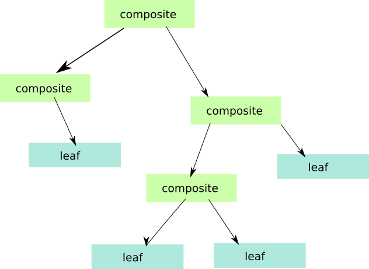

### Composite

O padrão Composite é bastante interessante e relativamente simples de entender. O próprio nome fornece algumas pistas.

Normalmente composto significa algo que é construido a partir de elementos mais simples, o que nos leva imediatamente a pensar num objecto que é
composto de outros mais simples. No entanto o padrão composite não se refere a um único objecto mas sim a uma árvore de objectos, onde encontramos
objectos compostos (Composite) e objectos simples (Leaf).

Primeiro vamos observar para uma árvore de objectos

Numa estrutura tipo árvore contamos com um elemento raiz (*root element*)) que, em principio, é sempre
composto por outros objectos (caso contrário não seria uma árvore).

Os objectos que compõe o elemento raiz podem ser eles próprios também compostos por outros (composite), ou objectos simples (leafs).

* Considera-se leafs (folhas) os objectos simples que como tal representam sempre o fim de um ramo.
* Considera-se Composite os objectos compostos, que por sua vez, podem incluir mais elementos compostos ou elementos simples.
A medida que o número de elementos vai crescendo vamos obtendo uma estrutura ramificada (dai o nome árvore).

Quando queremos construir este tipo de objectos, o padrão composite propõe-se resolver o problema.

Um excelente exemplo deste tipo de estutura é o HTML. O HTML é composto por elementos (tags) que normalmente podem incluir outras
tags dentro de si, e assim sucessivamente até que chegamos ao elemento mais interior que já não se divide mais.

Para representar uma estrutura em árvore, vamos necessitar de agrupar os objectos simples (*leafs*) e os objectos compostos(*composites*) de alguma forma,
e para isso recorremos a um interface ou classe abstracta que irá definir os métodos comuns que deverão ser implementados pelos
objectos simples e pelos objectos complexos.

Nessitaremos também de uma classe para representar os objectos simples (*leaf*) e outra para representar objectos complexos (*composites*) que irão implmentar
esse interface.

Para este padrão apresenta-se dois exemplos.

O Exemplo Composite one, tenta criar ums estrutura identica ao HTML. O exemplo composite two recria uma estrutura de uma empresa com
diversos departamentos. Cada departamento terá um Manager e cada Manager terá os seus subordinados.

A FAZER : Modelo UML

