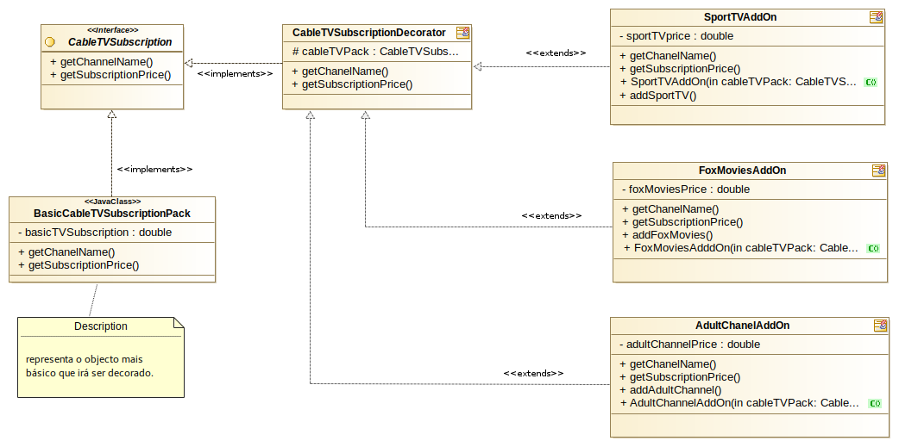

### Decorator exemplo 1

Este exemplo tem como objectivo mostrar como podemos combinar objectos utilizando o padrão
*Decorator*.

Vamos supor que necessitamos de implementar um sistema que permita a um operador de
servicos de TV por cabo criar os seus pacotes de canais para que os clientes possam selecionar
os canais num qualquer front end (web ou mobile por ex), e saber exactamente qual vai ser a mensalidade
que irão pagar por essa assinatura.

Inicialmente sabemos que o Operador dispõe de um pacote básico inicial, que é fornecido a todos os
clientes. Todos os restantes canais são adicões que o cliente pode ou não subscrever.

Vamos supor que o operador dispõe de 80 canais extras que o cliente pode combinar da forma que entender.

Verificamos imediatamente que criar código condicional (tipo If isto..então soma X ao preco base) não é prático,
é propenso a erros, e se precisarmos de o alterar futuramente encontraremos mais problemas.

Este é um bom candidato à utilizacão do padrão *Decorator*. Criamos o nosso produto base (o pacote básico inicial)
e podemos ir "decorando" o mesmo com os canais adicionais que o cliente por ventura possa escolher. No futuro, caso
seja necessário, poderemos adicionar ou remover *Decorators* com facilidade.

##### Representacão UML deste exemplo

(modelos UML criados com Modelio - https://www.modelio.org/)