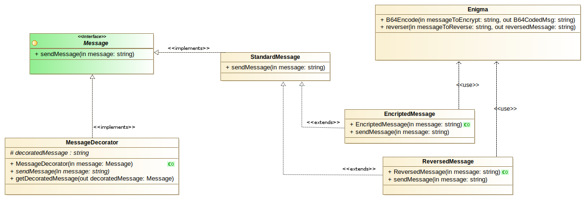

Este exemplo tem como objectivo mostrar como podemos alterar o comportamento de um objecto
durante o run time de uma aplicacão.

Vamos supor que tinhamos implementando um sistema de envio de mensagens.

O nosso sistema dispõe de um plano gratuito, mas esse plano apenas permite enviar
mensagens sem qualquer tipo de encriptacão *(plain text)*

A empresa criou 2 planos de subscricao extra, os quais permitem o envio de
mensagens encriptadas.

Os subscriptores do plano 1 recebem as mensagens com um nível de encriptacão simples
Os subscritores do plano 2 recebem as mensagens com um nível de encriptacao mais elevado.

Neste exemplo, a encriptacao simples é representada por uma simples inversão dos caracteres da mensagem,
e a encriptacão mais complexa é representada por uma codificacão em Base64. Estas codificacões estão
implementadas na classe Enigma.

Como vamos ver, gracas à utilizacão do padrão *Decorator* podemos utilizar combinacões e permutacões de
funcionalidades de forma simples.

Podemos enviar as mensagens de forma descodificada, podemos enviar as mensagens invertidas, codificadas
ou até codificadas e invertidas. E se necessitarmos de implementar mais funcionalidades, podemos adicionar
novos *decorators*

Se imaginar criar estas funcionalidades sem recorrer à composicão e à herditariedade, e tudo se tornará bem
mais complicado de gerir.

##### Representacão UML deste exemplo

(modelos UML criados com Modelio - https://www.modelio.org/)