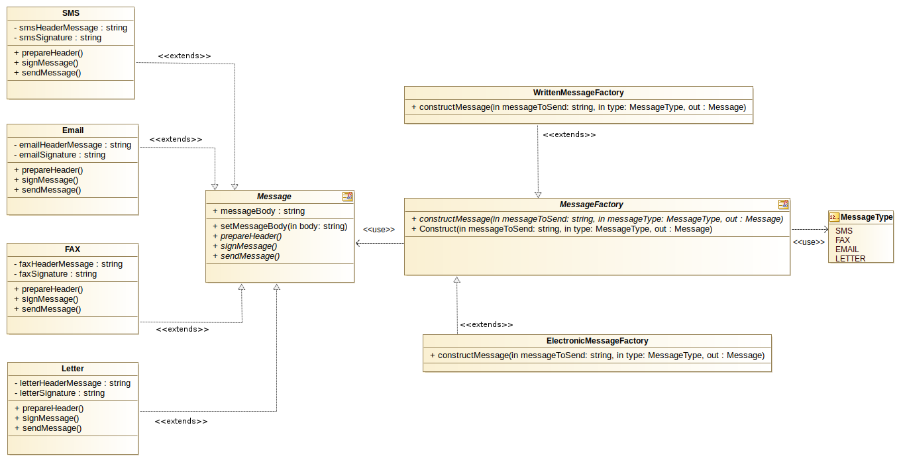

### FACTORY METHOD

Incluí-se nos padrões de desenvolvimento creacionais *(Creational Patterns)*

Tal como no exemplo de *FactoryPatternSimple* o *Factory Method* define um interface
(contrato) mas deixa que sejam as classes que implementam esse interface a tomar as decisões sobre qual a classe a
instanciar.
Ou seja, enquando na *FactoryPatternSimple* a própria Factory instancia os objectos, o *FactoryMethod* delega essas
decisões nas suas subclasses.

Por ser mais simples, nesta situacão, em vez de implementar os contratos em forma de interface, optou-se por
recorrer a classes abstractas. No entanto poder-se-ia utilizar interfaces, adaptando ligeiramente o código.

Habitualmente recorre-se ao padrão *Factory Method* quando a instanciacão de objectos se torna complexa. Ou seja,
não pretendemos receber apenas um objecto vazio (como acontece no Factory simples), mas necessitamos de receber
um objecto com estados já inicializados, o que eventualmente pode significar uma tarefa complexa.

O exemplo que se apresenta deriva da fábrica simples.

Agora a nossa loja de reparacões pretende efectuar duas alteracoes

1. Adicionar o envio de cartas.
2. Garantir que todas as mensagens enviadas tem um cabecalho standard para cada tipo,
um corpo e que são assinadas.

No padrão *FactoryPattern*, apenas recebemos um objecto vazio, não parece agora ser o ideal, pois teriamos de
criar mais código para desempenhar as funcionalidades necessárias, e esse código teria de se espalhar por todos os
locais da aplicacão que eventualmente utilizassem o recurso de enviar mensagens.
Fácil é de imaginar que nos poderiamos esquecer de algum ou alguns locais da aplicacão e de repente uma parte da
aplicacão enviava mensagens num formato e outra parte da aplicacão enviaria mensagens num formato diferente.

Assim, e em adicão ao que já foi dito para a *FactoryPattern*, o padrão *Factory Method* permite-nos também :

1. Criar classes de especializacão (classes com funcões especializadas)
2. Facilidade em adicionar funcionalidades futuras.

No exemplo, temos duas fábricas especializadas *WrittenMessageFactory* e *ElectronicMessageFactory* idealizando que
a primeira irá tratar de todas as mensagens que serão enviadas em papel (faxs e cartas) e a segunda irá tratar de
todas as comunicacões em formato electrónico (emails e SMS).

Essas duas fábricas especializadas extendem *MessageFactory*.

Tal como na *FactorySimple* os diversos tipos de mensagem estão vinculadas ao contrato *Message*

##### Representacão UML do exemplo

(modelos UML criados com Modelio - https://www.modelio.org/)

