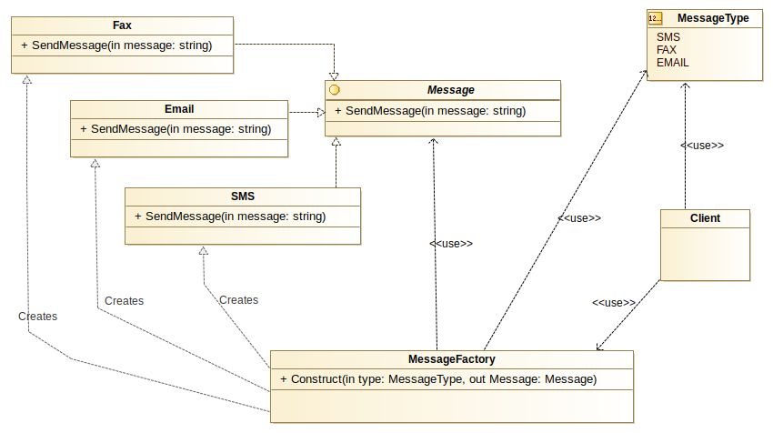

### Factory

Inclui-se nos padrões de desenvolvimento creacionais *(Creational Patterns)*

O padrão *Factory* é muito útil quando necessitamos de criar um objecto, mas à partida
não sabemos qual o tipo de objecto a criar, pois isso irá depender de um input
qualquer que apenas saberemos na hora.

Uma *factory* apresenta várias vantagens

1. Permite-nos esconder a lógica de criacão dos objectos dos clientes.
2. Removemos toda a lógica de implementacao do cliente, tornando o código
menos acopolado e mas fácil de manter.
3. Podemos alterar completamente a lógica de um objecto sem necessitar
de alterar código no cliente.
4. Criamos uma abstracao entre a implementacão e o cliente através da utilizacão de
herditariedade.
5. Programamos em funcão de um Interface.

Imaginemos uma loja de reparacões, cujo sistem deve enviar uma mensagem aos seus
clientes sempre que um equipamento está reparado e pronto para ser recolhido.

No entanto, alguns clientes querem receber essa mensagem por SMS, outros pretendem
receber por Email e outros pretendem receber por fax.

Podemos claro encher uma classe com Ifs e criar código para o envio de
cada tipo de mensagem. É uma solucão.

Agora vamos imaginar que queremos criar uma funcionalidade que faz a mesma coisa,
mas para informar clientes que tem facturas em atraso...Vamos repetir tudo novamente ?
Funciona...
Mas e se criarmos uma fábrica de mensagens reutilizável ?

A primeira coisa que repararmos, é que existe um elemento comum a todas as comunicacoes
que precisamos de implementar..Então podemos agrupa-las de alguma forma como sendo do
tipo Mensagens. Podemos utilizar um Interface para isso.
E isso já nos vai facilitar muita coisa como podemos verificar no exemplo.

Um Interface Message, uma classe para cada tipo de mensagem, e uma fábrica que vai
criar e devolver um objecto do tipo apropriado, de acordo com o que lhe for solicitado.

Também se pode utilizar classes abstratas, mas para manter o exemplo o mais simples
possivel, utilizei apenas um interface com um método que trata de enviar mensagens.

##### Representacão UML do exemplo

(modelos UML criados com Modelio - https://www.modelio.org/)