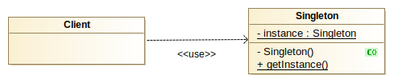

### Singleton

Inclui-se nos padrões de desenvolvimento creacionais *(Creational Patterns)*

Por vezes é importante que uma classe seja instanciada uma única vez
durante todo o ciclo de vida de uma aplicacao.

As boas práticas dizem-nos que devemos ser parcos na utilizacao dos *Singletons*, no entanto, estes podem
ser extremamente uteis quando nos deparamos com situacoes cuja instanciacao
de um objecto pode ter elevados custos de tempo e / ou memória. Nestes casos,
o ideal será criar apenas um objecto e reutiliza-lo sempre que necessário.
(por ex. criar ligacoes a bases de dados)

Os dois aspectos principais de um *Singleton* são :

1. Deve garantir-se a existência de **uma e apenas uma** instância da classe.
2. Deve possibilitar um acesso global a essa instancia.

Existem duas formas de instanciar os *Singletons* :

1. Instanciacão *Lazy* (perguicosa).
2. Instanciacao *Eager* (ansiosa).

Sempre que isso nos for possivel devemos preferir os métodos *Lazy*

Qual a diferenca entre os dois métodos ?

No modelo de instanciacao Eager, a instancia do *Singleton* é criada
assim que a JVM efectua o *ClassLoad* da mesma. Ou seja, mesmo que
ainda não necessitemos de utilizar o Singleton, os recursos que ele
eventualmente necessite, já estão a ser consumidos.

Já no modo de instanciacao *Lazy* os recursos vão ser consumidos apenas
no primeiro momento em que efectivamente solicitamos a instancia.

Nestes nossos exemplos, e para simplificar, recorremos ao *HashCode* dos
objectos, para que seja possivel verificar que a instancia do objecto
é sempre a mesma.

##### Dois objectos com o mesmo HashCode referem-se ao mesmo objecto.

NOTAS :

1. Em aplicacões multithread, um singleton baseado na implementacão
*Eager* é seguro, no entanto se pretendermos recorrer à implementacão
*Lazy* deveremos sincronizar o método que fornece a instancia.

2. Os enum em Java são por natureza Singletons, e estão disponíveis para acesso
global. O ponto negativo é que não suportam instanciacão *lazy* e o ponto positivo
é que são thread-safe.

##### Representacão UML

(modelos UML criados com Modelio - https://www.modelio.org/)

## NOTA SOBRE OS TESTES

No testes para o LazySingleton, irão ocorrer falhas no teste
*testMultithreadLazySingletonInstantiation*
que nos demonstram que a instanciacão lazy em ambientes multithreaded
não é segura.

Pode no entanto acontecer, que ocasionalmente os testes passem.

Por essa razão utilizamos valores elevadissimos (900 mil) para lancar
threads.
